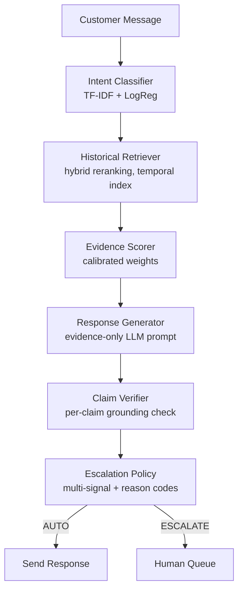

# EvidenceDesk — AI Customer Support Operations

> **Answer because the evidence is there. Escalate because it isn't.**

EvidenceDesk is an internal customer-support workspace where an AI agent helps human
agents resolve customer issues. For every customer message it classifies intent,
retrieves **historically resolved conversations** as evidence, drafts a grounded reply,
independently verifies every claim, and decides **AUTO** (safe to answer) or
**ESCALATE** (route to a human) — with named, inspectable reason codes every time.

Built as the Hiver SDE Intern take-home: *"Evidence-First Customer Support Agent."*

---

## 1. The product

```
Customer message
  → Understand intent
  → Find similar historically resolved cases
  → Generate a grounded response
  → Check evidence / grounding / risk
  → AUTO or ESCALATE
```

The UI leads with the support workflow — **Inbox** (three-pane ticket workspace with an
AI Copilot), **AI Assistant** (full analysis trail for any pasted message),
**Escalated** (human queue), **Resolved** (AI-handled audit trail). AI insights and
engineering evaluation are secondary navigation:

| Section | Pages |
|---|---|
| **Support** | Inbox · AI Assistant · Escalated · Resolved |
| **Insights** | Overview · AI Performance · Retrieval Quality · Failure Analysis |
| **Evaluation** | Golden Set · LLM Judge |
| **Admin** | Decision Log · System |

## 2. Why this approach

The naive AI answer is "wire an LLM to a prompt and send its output to customers."
That fails in a specific, expensive way: the model confidently answers when it
shouldn't, and nobody can audit why. EvidenceDesk is the missing half — the
measurement and safety layer that decides *when answering is justified at all*:

- A pipeline of small, auditable stages — not one giant prompt.
- **Abstention is a feature**: when historical evidence is insufficient, the system
  escalates rather than produce an unsupported customer-facing claim.
- Every escalation carries a **named reason code** (`UNSUPPORTED_CLAIMS`,
  `PRIVACY_RISK`, `OOD_REQUEST`, `MULTI_INTENT`, `HIGH_RISK_INTENT`, …).

## 3. Architecture



Backend: Flask + gunicorn. Frontend: static HTML/CSS/JS served by the backend (nginx
in Docker). Data: TF-IDF/scikit-learn throughout.

## 4. The pipeline in detail

1. **Intent classification** — TF-IDF (1–2 grams) + multinomial logistic regression,
   12-intent taxonomy discovered from the data (clustered, then human-merged).
   Returns the full probability distribution; a narrow top-2 margin feeds the
   ambiguity signal.
2. **Historical retrieval** — TF-IDF cosine over ~17k *resolved* conversations with a
   **temporal index** (only conversations earlier than the query period — a live
   system can never retrieve evidence from the future). Hybrid reranking combines
   semantic similarity, BM25 lexical relevance, classifier-based intent
   compatibility, and resolution quality, minus a contradiction penalty.
3. **Evidence scoring** — quality features (top similarity, intent agreement among
   retrieved cases, resolution consistency, case count) combined with weights fitted
   on dev data — not hand-picked. Classifier confidence is deliberately excluded.
4. **Grounded generation** — the LLM (Groq / Gemini / deterministic mock) receives an
   evidence-only structured prompt (policy / message / evidence as separate fields —
   a prompt-injection defense) and must abstain when evidence is insufficient.
   Historical customer messages are excluded from the prompt: resolutions are what a
   reply is grounded in, not what customers historically shouted.
5. **Claim verification** — claims are extracted from the **actual draft text** and
   verified against the retrieved evidence independently. The LLM's self-report is
   never trusted.
6. **Escalation policy** — hard fail-safes first (retrieval failure, generation
   failure, privacy risk, unsupported claims, OOD, multi-intent, high-risk intents),
   then evidence/confidence/grounding thresholds. Output: AUTO or ESCALATE with
   reason codes and a risk level.

## 5. Dataset

Kaggle "Customer Support on Twitter" (`twcs.csv`), brand **AmazonHelp** — selected
by data-driven brand profiling (most resolvable engagements), not fame.

- 60,000 reconstructed conversations (`scripts/build_dataset.py`) — real customer/agent
  threads recovered via the reply graph.
- 44,375 English-filtered, silver-labeled conversations with a temporal
  train/dev/test split (temporal, to prevent duplicate-content leakage — a naive
  random split leaks 2,701 duplicate groups; the temporal split has 16).
- A **200-example human-verified golden set** (stratified, deliberately hard-weighted).

The Inbox shows this real data: real conversation threads, sanitized display
(@mentions and links masked, stable `Customer #NNNN` references). No invented
customers, no fabricated history.

## 6. The misleading headline number — and the golden gap

**Read this before quoting any accuracy figure.**

| Model | Accuracy (silver) | Macro-F1 (silver) | Accuracy (golden, human-verified) | Macro-F1 (golden) |
|---|---|---|---|---|
| Majority baseline | 22.8% | 0.034 | 14.5% | 0.021 |
| TF-IDF + LogisticRegression | 93.6% | 0.869 | **19.5%** | **0.182** |

The 93.6% is **not real-world accuracy**: silver labels were produced by the same
TF-IDF+KMeans clustering process that shaped the training taxonomy — the classifier
is partly graded by the process that taught it. Against 200 human-verified golden
examples, the current classifier scores **19.5%**. Root cause (traced in
`reports/golden_gap_analysis.md`): the 2026-09-12 cluster→intent remap sent ~52% of
the corpus to `general_other` and left some intents with as few as 6 training
examples. Both silver and golden numbers are always reported side by side — in this
README, in `reports/`, and throughout the UI. Neither should ever be quoted alone.

Retrieval: Recall@1=49.5%, Recall@3=71.4%, Recall@5=83.3%, MRR=0.617
(`reports/retrieval_metrics.json`) — TF-IDF's paraphrase ceiling is the identified
bottleneck; sentence embeddings slot in behind the existing `EmbeddingProvider`
interface.

## 7. Evaluation

Every number in `reports/` is produced by a committed script — nothing hand-typed,
nothing hardcoded in the UI (the frontend renders "Not evaluated" when an artifact
is missing):

| What | Where |
|---|---|
| Baselines (majority vs TF-IDF+LogReg) | `scripts/evaluate_baselines.py` |
| Retrieval Recall@k / MRR (temporal index) | `scripts/evaluate_retrieval.py` |
| Evidence-score calibration | `scripts/calibrate_evidence_score.py` |
| Automation precision/coverage + golden check | `scripts/evaluate_automation.py` |
| Golden set build + human corrections | `scripts/build_golden_set.py`, `scripts/apply_golden_corrections.py` |
| Golden evaluation + gap decomposition | `scripts/evaluate_against_golden.py` |
| Failure taxonomy from real misclassifications | `scripts/analyze_failures.py` |
| LLM-as-judge harness + agreement stats | `backend/app/evaluation/judge.py`, `agreement.py` |

**LLM judge status:** implemented, unit-tested, and executed live (2026-09-16): 50
golden-subset replies generated via Groq, judged by the live judge, compared against
**proxy** human scores derived programmatically from golden labels. The agreement
numbers in `reports/judge_human_agreement.json` are judge-vs-proxy — they prove the
pipeline works end-to-end, **NOT** that the judge agrees with humans. The UI states
this as NOT VALIDATED and never presents mock or proxy numbers as validation.

## 8. How to run

```bash
# Linux/macOS
python3 -m venv .venv && source .venv/bin/activate
# Windows (PowerShell)
python -m venv venv; .\venv\Scripts\Activate.ps1

pip install -r requirements.txt        # pinned to the training env — see docs/reproducibility.md

# 1. Place the Kaggle "Customer Support on Twitter" twcs.csv at data/raw/twcs.csv

# 2. Run the pipeline (~15 min, seeded & reproducible; see scripts/ for flags)
python scripts/profile_dataset.py
python scripts/build_dataset.py --brand AmazonHelp --sample-size 60000
python scripts/discover_intents.py --brand AmazonHelp
python scripts/build_labeled_dataset.py --brand AmazonHelp
python scripts/evaluate_baselines.py --brand AmazonHelp
python scripts/evaluate_retrieval.py --brand AmazonHelp --max-eval-queries 1500
python scripts/calibrate_evidence_score.py --brand AmazonHelp
python scripts/evaluate_automation.py --brand AmazonHelp
python scripts/build_golden_set.py --brand AmazonHelp
python scripts/apply_golden_corrections.py
python scripts/evaluate_against_golden.py --brand AmazonHelp
python scripts/analyze_failures.py --brand AmazonHelp
python scripts/train_and_save_agent.py --brand AmazonHelp
python scripts/export_golden_with_predictions.py --brand AmazonHelp

# 3. Demo (mock mode by default)
python demo.py

# 4. Tests (no network, no API key needed)
cd backend && python -m unittest discover -s tests -p "test_*.py"

# 5. Run EvidenceDesk
cd backend && python -m app.api.app     # dev server → http://localhost:8000
# Production:
cd backend && gunicorn -c gunicorn.conf.py wsgi:application

# 6. Docker
docker compose up --build               # UI: http://localhost:3000 · API: :8000
```

**Environment note:** process-level environment variables override `.env` values.

## 9. Mock mode vs live Groq

| | MOCK | LIVE |
|---|---|---|
| Selection | `LLM_PROVIDER=mock` | `LLM_PROVIDER=groq` + `GROQ_API_KEY` |
| Top-bar pill | **MOCK MODE** (amber) | **LIVE** (green) — only after a *measured* successful provider check |
| Draft provenance | every draft is visibly labeled "MOCK RESPONSE" | labeled with provider + model |
| Silent fallback | **never** — an unconfigured live provider returns HTTP 503 `PROVIDER_NOT_CONFIGURED`; it is never quietly replaced by mock | — |

`GET /api/v1/provider/health?verify=1` performs a real minimal provider call and
reports measured status (`LIVE` / `MOCK` / `NOT_CONFIGURED` / `ERROR` / `UNVERIFIED`
/ `OFFLINE` in the UI). "Configured" never masquerades as "verified working."

## 10. API

```
GET  /health                          liveness + provider mode + product identity
GET  /api/v1/provider/health?verify=1 measured provider status
GET  /api/v1/intents                  the 12-intent taxonomy
GET  /api/v1/inbox                    support tickets (?q=&intent=&status=&page=)
GET  /api/v1/conversations/<id>       full real thread
POST /api/v1/agent/classify           {"message"} → intent + distribution
POST /api/v1/agent/retrieve           {"message","k"} → historical evidence
POST /api/v1/agent/respond            {"message","k","conversation_id"?} → full
                                      decision trail; persists a decision record
GET  /api/v1/agent/decisions          runtime decision log (?limit=&offset=&decision=)
GET  /api/v1/agent/decisions/<id>     one decision record
GET  /api/v1/escalations              ESCALATE queue (real stored decisions)
GET  /api/v1/resolved                 AUTO list (real stored decisions)
GET  /api/v1/retrieval/explorer       retrieval-only inspection (?q=&k=)
GET  /api/v1/evaluation/summary|failures|automation|gap|intents
GET  /api/v1/golden-set/summary|examples
GET  /api/v1/llm-judge/summary        status + honest NOT VALIDATED labeling
GET  /api/v1/decisions                design decision log + runtime summary
GET  /api/v1/system                   runtime/artifact/provider status
```

Every request gets an `X-Request-ID` echoed in bodies, logs, and stored decisions —
the inbox, the decision log, and the structured logs all reference the same id.
Errors use one shape: `{"error": {"code", "message", "request_id"}}`.

## 11. Recruiter demo flow

1. Open EvidenceDesk → the **Inbox**: real AmazonHelp conversations.
2. Open a ticket → the real thread with metadata and status.
3. Click **AI Assist** → intent + confidence visualization.
4. Inspect **historical evidence**: similar resolved cases with similarity, intent,
   resolution, and "Why this evidence?" explanations.
5. Read the **suggested reply**, its grounding status, and risk.
6. See the **AI decision** (AUTO or ESCALATE) and click through the **"Why?"** card.
7. **Escalated** — anything the AI refused, with reason codes; inspect a record.
8. **AI Assistant** — paste any message (try "What is the capital of India?") and
   watch OOD detection force an escalation.
9. **Insights → Retrieval Quality** — run the Retrieval Explorer on any message.
10. **Failure Analysis** — real golden-set misclassifications, categorized.
11. **Decision Log** — every decision traceable by request ID.
12. **System** — verify provider state (measured, never assumed).

## 12. Design decisions

The 20+ non-obvious decisions with reasons and trade-offs: `docs/decision-log.md`
(also rendered in the UI). Highlights: temporal split to prevent leakage (#2),
evidence score excluding classifier confidence (#6), high-risk intents hard-gated to
escalation (#11), Flask over FastAPI (#13), mock as the only fully-exercised LLM
path in the build sandbox (#14).

## 13. Known limitations

- **TF-IDF semantic ceiling** — no paraphrase matching; Recall@1 ≈ 49.5% bounds
  evidence quality.
- **Golden accuracy 19.5%** — the Sep-12 remap degraded the classifier (see §6);
  retraining from the corrected mapping is recorded as the real fix, not silently
  applied.
- **Live LLM paths are implemented, unit-tested, and live-verified** — real Groq
  calls ran in this environment (health check, 50 generations, 50 judge calls). What
  remains NOT RUN: live generation over the full golden set and comparison against
  REAL (non-proxy) human scores.
- **`general_other` is an uncertainty bucket**, not a clean business intent.
- **Ambiguity/multi-intent/novelty signals are experimental** — direction-tested,
  only ever escalate, never force AUTO.
- **Single golden-set labeler** — no inter-annotator agreement measurement.
- **Grounding is literal** (word-overlap), not semantic entailment.
- Docker is built and smoke-verified, not load-tested.

## 14. Future work

1. Retrain the classifier from the corrected cluster→intent mapping.
2. Sentence-embedding retrieval behind `EmbeddingProvider` — the Recall@1 bottleneck.
3. Full live-LLM evaluation with REAL human scoring → VALIDATED judge status.
4. Expand the golden set past 200 (auto-precision CI ±15 points is too wide).
5. Calibration of evidence-score features against a groundedness target.

---

**Verification status:** `FINAL_VERIFICATION.md` records exactly what was run in the
build environment and what was not. `AUDIT_BEFORE_UI_REDESIGN.md` records the
pre-redesign architecture and what the redesign changed. Nothing in this README
claims more than those files verify.
