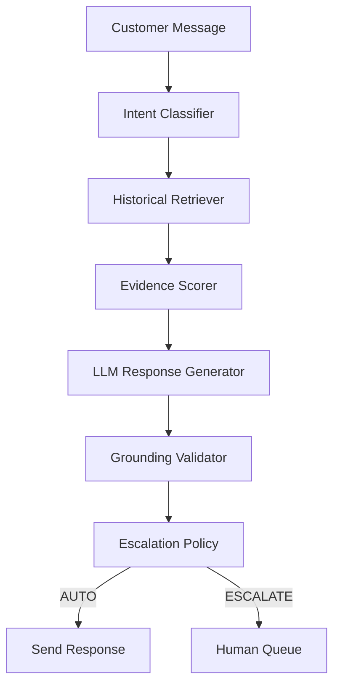

# Evidence-First Customer Support Agent

> **This system intentionally trades automation coverage for safer automation.**

An AI support agent for **AmazonHelp** (selected via data-driven brand profiling, not fame) that
classifies customer intent, retrieves historically resolved cases, drafts evidence-grounded replies,
independently validates every claim, and decides AUTO-HANDLE vs. ESCALATE — with named, inspectable
reason codes every time.

**Core principle:** don't answer because the model is confident; answer because the system has enough
historical evidence to answer safely. Otherwise, escalate — abstention is always preferable to an
unsupported customer-facing claim.

## 1. Problem

Customer support teams drown in repetitive tickets. The naive AI answer is "wire an LLM to a prompt
and send its output to customers." That fails in a specific, expensive way: the model confidently
answers when it shouldn't, and nobody can audit why. This project builds the missing half — the
measurement and safety layer that decides *when answering is justified at all*.

## 2. Why this approach

The system is a pipeline of small, auditable stages — not one giant prompt:

```
Customer message
  → Intent classification (TF-IDF + LogisticRegression, 12-intent taxonomy discovered from data)
  → Historical evidence retrieval (TF-IDF cosine over 17k resolved conversations, temporal index)
  → Evidence quality scoring (empirically calibrated weights, not hand-picked)
  → Grounded draft generation (LLM, evidence-only prompt, must abstain if evidence is insufficient)
  → Grounding validation (claims verified against evidence independently — the LLM is not trusted)
  → Multi-signal escalation policy (named reason codes; high-risk intents are hard-gated to ESCALATE)
  → AUTO-HANDLE or ESCALATE, with a stated reason
```

## 3. Architecture



Backend: Flask (see decision-log.md #13 for why not FastAPI) + gunicorn in production.
Frontend: an internal operations console (static HTML/CSS/JS, no build step) served by the backend.
Data: TF-IDF/scikit-learn throughout (see decision-log.md #3 for the embedding swap path).

## 4. Demo

```bash
python demo.py          # 5 representative cases with visible reasoning
```

Or run the full product: `cd backend && python -m app.api.app` → open http://localhost:8000.
The dashboard is an operations workspace: Overview (trust summary), Live Agent (inspectable
decision trail), Evaluation, Failure Analysis, Golden Set, LLM Judge, Decision Log, System.

## 5. Results

**Read section 6 before quoting any single number from this section.**

| Model | Accuracy (silver test) | Macro-F1 (silver) | Accuracy (golden, human-reviewed) | Macro-F1 (golden) |
|---|---|---|---|---|
| Majority baseline | 22.8% | 0.034 | 14.5% | 0.021 |
| TF-IDF + LogisticRegression | 93.6% | 0.869 | **19.5%** | **0.182** |

Retrieval: Recall@1=49.5%, Recall@3=71.4%, Recall@5=83.3%, MRR=0.617 (`reports/retrieval_metrics.json`).

Leakage prevention: a naive random split would leak 2,701 duplicate-content groups across
train/test; the temporal split has 16 (`reports/leakage_analysis.json`).

## 6. The misleading headline number — and the golden gap

The 93.6% accuracy is **not real-world accuracy**. It is measured against *silver* labels produced
by the same TF-IDF+KMeans clustering process that shaped the training taxonomy — the classifier is
partly being graded by the process that taught it. Against 200 human-verified golden-set examples,
the current classifier scores **19.5%** — a 74-point gap.

**Which golden number is current?** The commonly-quoted **53.5%** was measured against the
*pre-remap* classifier artifact (before the 2026-09-12 cluster→intent remap recorded in decision
#19 of `docs/decision-log.md`). The dataset was rebuilt and the model retrained on 2026-09-14; the
current, reproducible golden accuracy is **19.5%**
(`reports/golden_set_evaluation.json`, regenerated 2026-09-14). We deliberately do not quote the
stale 53.5%: an honest gap is a diagnostic signal, a stale flattering artifact is a liability.

Root cause of the gap (traced, not guessed): the Sep-12 remap sent the largest corpus cluster
(~52% of conversations) to `general_other` and left specific intents (e.g. `account_access_issue`)
with as few as 6 training examples, collapsing golden accuracy while silver accuracy (graded by
the same labels that trained the model) stayed at ~93.6%. Cluster-derived silver labels also
agree with the human golden labels only ~21.5% of the time. Full decomposition:
`reports/golden_gap_analysis.md`.

Both silver and golden numbers are always reported side by side — in this README, in `reports/`,
and throughout the dashboard UI. Neither number should be quoted alone. The historical
circularity analysis is preserved in `reports/misleading_headline_number.md`.

## 7. Failure analysis

Generated from the real golden-set misclassifications (`reports/failure_analysis.md`, 161
failures at the current 19.5% golden accuracy; shares below are of those failures):

| Failure mode | Share | Hypothesis (short) |
|---|---|---|
| Out-of-distribution | 24.2% | Message fits no taxonomy intent; classifier confidently picks a wrong one instead of abstaining. |
| Other classifier error | 23.6% | Genuine feature overlap between semantically related intents. |
| Ambiguous intent | 20.5% | Two intents fit about equally; TF-IDF can't resolve without semantics. Now feeds an explicit ambiguity signal → escalate. |
| Multi-intent message | 14.9% | Multiple issues in one message; taxonomy assumes one intent. Now detected via keyword-signal disagreement → escalate. |
| Noisy short message | 10.6% | Too little token signal; needs conversation context. |

Every example shown in the UI's Failure Analysis page is a real misclassification with predicted vs.
actual intent — none are invented.

## 8. How to run

```bash
# Linux/macOS
python3 -m venv .venv && source .venv/bin/activate
# Windows (PowerShell)
python -m venv venv; .\venv\Scripts\Activate.ps1

pip install -r requirements.txt        # pinned to the training env — see docs/reproducibility.md

# 1. Place the Kaggle "Customer Support on Twitter" twcs.csv at data/raw/twcs.csv
#    (Kaggle: thoughtvector/customer-support-on-twitter)

# 2. Run the pipeline (~15 min total on one core; each step is seeded & reproducible)
python scripts/profile_dataset.py                                    # ~15s
python scripts/build_dataset.py --brand AmazonHelp --sample-size 60000  # ~65s
python scripts/discover_intents.py --brand AmazonHelp                # ~20s
python scripts/build_labeled_dataset.py --brand AmazonHelp           # ~15s
python scripts/evaluate_baselines.py --brand AmazonHelp              # ~10s
python scripts/evaluate_retrieval.py --brand AmazonHelp --max-eval-queries 1500  # ~30s
python scripts/calibrate_evidence_score.py --brand AmazonHelp        # ~15s
python scripts/evaluate_automation.py --brand AmazonHelp             # ~60s
python scripts/build_golden_set.py --brand AmazonHelp                # ~10s
python scripts/apply_golden_corrections.py                           # instant
python scripts/evaluate_against_golden.py --brand AmazonHelp         # ~10s
python scripts/analyze_failures.py --brand AmazonHelp                # ~10s
python scripts/train_and_save_agent.py --brand AmazonHelp            # ~15s
python scripts/export_golden_with_predictions.py --brand AmazonHelp  # feeds the Golden Set UI

# 3. Run the demo (mock mode by default)
python demo.py

# 4. Run the tests (no network, no API key needed)
cd backend && python -m unittest discover -s tests -p "test_*.py"

# 5. Run the product
cd backend && python -m app.api.app     # dev server → http://localhost:8000
# Production:
cd backend && gunicorn -c gunicorn.conf.py wsgi:application

# 6. Docker (verified — see FINAL_VERIFICATION.md)
docker compose up --build
```

**Environment note:** process-level environment variables override `.env` values (dotenv does not
override already-set variables). If `MODEL_NAME` is set in your shell, that value wins over `.env`.

## 9. Evaluation

Every number in `reports/` is produced by a committed script — nothing hand-typed:

- Baselines: majority class vs. TF-IDF+LogReg (`evaluate_baselines.py`)
- Retrieval: Recall@1/3/5, MRR with a strictly-earlier-splits index (`evaluate_retrieval.py`)
- Evidence scoring: logistic-regression calibration on dev (`calibrate_evidence_score.py`)
- Automation: precision/coverage sweep + golden check of the untouched threshold (`evaluate_automation.py`)
- Golden set: 200 human-verified examples, documented methodology (`data/golden/README.md`)
- Failure analysis: real misclassifications, categorized (`analyze_failures.py`)
- LLM-as-judge harness + agreement stats: implemented and unit-tested; **mock-only in this
  environment — explicitly NOT VALIDATED** (`judge.py`, `agreement.py`)

Grounding-quality metrics require live LLM generation and are labeled **NOT AVAILABLE IN MOCK MODE**
wherever they would otherwise appear.

## 10. API

```
GET  /health                      liveness + mock/live mode
GET  /api/v1/intents              the 12-intent taxonomy
POST /api/v1/agent/classify       {"message"} → intent + confidence + top-5 distribution
POST /api/v1/agent/retrieve       {"message", "k"} → historical evidence cases
POST /api/v1/agent/respond        {"message", "k"} → full decision trail (intent, evidence,
                                  ambiguity signals, draft, grounding, decision, reason codes)
GET  /api/v1/evaluation/summary   all evaluation reports, joined
GET  /api/v1/evaluation/failures  failure analysis
GET  /api/v1/evaluation/automation  precision/coverage curve + golden check
GET  /api/v1/evaluation/intents   per-intent metrics (silver + golden)
GET  /api/v1/golden-set/summary   golden set methodology data
GET  /api/v1/golden-set/examples  browser w/ filters (?outcome=&intent=&q=)
GET  /api/v1/llm-judge/summary    judge status (NOT VALIDATED until human-verified)
GET  /api/v1/decisions            decision log (parsed from docs/decision-log.md)
GET  /api/v1/system               runtime/artifact status
```

Every request gets a request ID (`X-Request-ID` header, echoed in bodies and logs); every error uses
one JSON shape (`{"error": {"code", "message", "request_id"}}`); agent decisions emit one structured,
PII-free log line each.

## 11. Design decisions

The 15 non-obvious decisions with reasons and trade-offs: `docs/decision-log.md` (also rendered in
the UI's Decision Log page). Highlights: temporal split to prevent leakage (#2), evidence score
excluding classifier confidence (#6), resolution_consistency's near-zero weight kept and explained
(#7, #16), high-risk intents hard-gated to escalation (#11), Flask over FastAPI for the executed
backend (#13), mock mode as the only end-to-end-exercised LLM path in the build sandbox (#14).

## 12. Limitations

- **TF-IDF semantic ceiling** — no paraphrase matching; Recall@1 ≈ 49.5% bounds evidence quality.
- **Live LLM paths are implemented and unit-tested, but were only smoke-verified** — the Groq
  provider made real calls with a real key in this environment (see FINAL_VERIFICATION.md), yet no
  full live evaluation (generation over the golden set + judge + human agreement) was run.
- **`general_other` is an uncertainty bucket**, not a clean business intent.
- **Ambiguity/multi-intent signals are experimental** — direction-tested, not validated against a
  labeled ground truth; they only ever escalate, never force AUTO.
- **Single golden-set labeler** — no inter-annotator agreement measurement.
- **Resolution-consistency calibration** is wired at runtime but calibrated against the wrong
  (classifier-correctness) target; proper calibration needs live groundedness data.
- Docker: built and smoke-verified in this environment (see FINAL_VERIFICATION.md) — not a
  production-hardened deployment.

## 13. Future work

1. Full live-LLM evaluation: generation over the golden set, judge scoring, human agreement.
2. Expand the golden set past 200 — the automation-precision CI (±15 points) is too wide to trust
   a specific operating point.
3. Sentence-embedding retrieval behind the existing `EmbeddingProvider` interface — the Recall@1
   bottleneck.
4. Second independent labeler → real inter-annotator agreement.
5. Calibrate evidence-score features against a groundedness target instead of classifier correctness.

---

**Verification status of everything above:** `FINAL_VERIFICATION.md` records exactly what was run
in the build environment and what was not — tests, browser checks, Docker build/run, live LLM call,
and the reproducibility re-run. Nothing in this README claims more than that file verifies.
