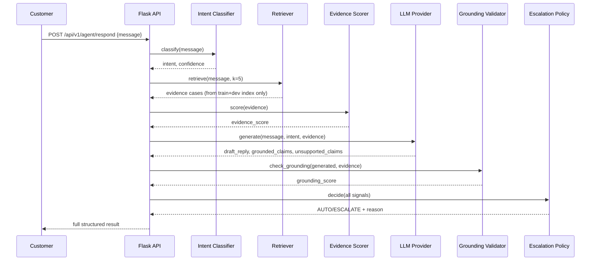

# Architecture

## Request flow (live agent)



## Data flow (offline pipeline)

```
twcs.csv (2.81M rows, streamed)
  -> lightweight graph index (tweet_id -> author/inbound/parent, ~120MB in memory)
  -> brand profiling (108 candidates scored) -> AmazonHelp selected
  -> conversation reconstruction (60,000-conversation seeded sample)
  -> language filter + TF-IDF clustering -> 12-intent taxonomy (human-merged)
  -> temporal train/dev/test split + leakage analysis
  -> baselines (majority, TF-IDF+LR) trained & evaluated
  -> retrieval index (train+dev only) + Recall@K/MRR evaluation
  -> evidence-score calibration (logistic regression on dev split)
  -> automation precision/coverage sweep
  -> golden set (200 examples, stratified, manually verified)
  -> golden-set cross-check of silver-based numbers
  -> failure analysis (real golden-set misclassifications)
  -> trained artifacts persisted to models/
```

## Evaluation flow

```
Silver test set (7,560, cluster-derived labels)
  -> baseline metrics, retrieval metrics, automation curve
       |
       v  (independently, no shared code path)
Golden set (200, hand-verified labels)
  -> golden-set accuracy/F1
  -> golden-set automation-threshold sanity check
       |
       v
reports/misleading_headline_number.md  (the comparison IS the deliverable)
```

## Why this shape

Each stage is a separate, independently testable module specifically so the "trust the response"
question can be answered by pointing at a specific stage's output (which evidence, what
similarity, what grounding score) rather than a single opaque model call. See
`docs/decision-log.md` for the reasoning behind each major structural choice.
